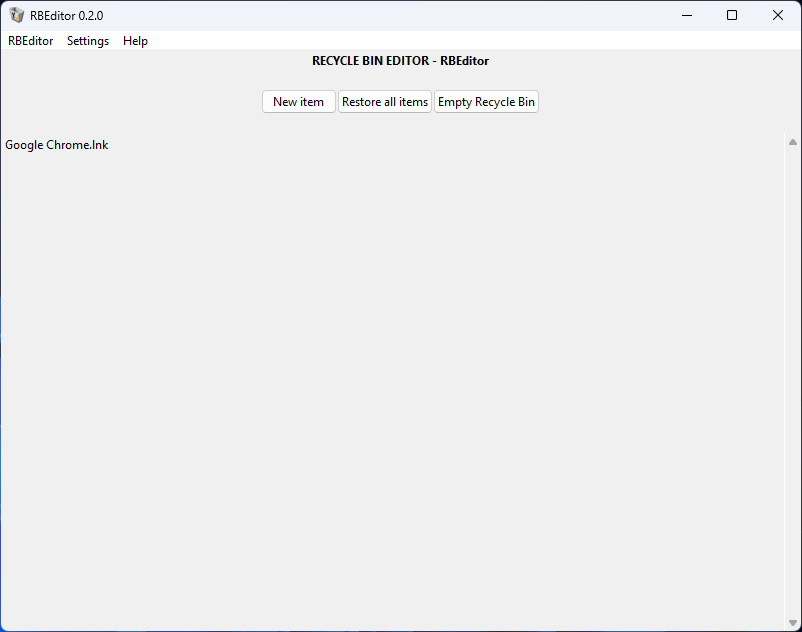

**RBEditor** is a tool that can edit the Recycle Bin's contents and also open and edit files and folders inside the Recycle Bin. The program was inspired by [this video by Mr. Fly Tech](https://www.youtube.com/watch?v=jk8Io_cgYyY).

**Supports Windows Vista - Windows 11**

  
<a href="https://s11.gifyu.com/images/rbeditor_gif.gif">(OUTDATED) RBEditor v1.3.0_01 GIF</a>

[Download for Windows Vista, 7, 8, 8.1, 10, 11](../../releases/latest)  

<b>View compatibility list</b>
 
<table style="width:100%">
  <tr>
    <th>RBEditor binary version</th>
    <th>Windows version required</th>
  </tr>
  <tr>
    <td>0.1.0+</td>
    <td>At least Windows Vista</td>
  </tr>
  <tr>
    <td>Beta 1.2.1_01 - Beta 1.4.0</td>
    <td>At least Windows 7</td>
  </tr>
  <tr>
    <td>Beta 1.1.0 - Beta 1.2.1</td>
    <td>At least Windows 10</td>
  </tr>
</table>

# Features
- Create files and folders in the Recycle Bin (without any deletion)
- Open and edit files and folders in the Recycle Bin
- Normal Recycle Bin actions (delete, restore)
- Edit Recycle Bin file metadata
- **Hacker mode**
- Multilanguage support

# Languages
RBEditor currently has these available languages:

| Language | Version Added |
|--|--|
| English | [Beta 1.0.0](../../releases/tag/b1.0.0) |
| Spanish | [1.0.0-dev4](../../releases/tag/v1.0.0-dev4) |
| French | [1.0.0-dev3](../../releases/tag/v1.0.0-dev3) |
| Japanese | [Beta 1.3.0](../../releases/tag/b1.3.0) |
| Vietnamese | [Beta 1.0.0](../../releases/tag/b1.0.0) |

# Running and building from source code
If you're just wanting to run RBEditor, download the appropriate EXE file in [the Releases page](../../releases/latest).

For builds without EXE files, you can follow the steps below to build from source code. Note that this requires a little bit of technical knowledge!

## Requirements
These are the minimum requirements to run and build RBEditor from source code:
- At least [Python 3.6.0a4](https://www.python.org/downloads/release/python-360a4/)
- [The WMI module](https://pypi.org/project/WMI/)
- [The Requests library](https://pypi.org/project/requests/) (required to check for updates on versions [0.2.1](../../releases/tag/v0.2.1) and older)
- [The PyInstaller module](https://pypi.org/project/pyinstaller/) (not required if you don't need to build)
- At least Windows Vista (note: RBEditor **cannot** be run or built on Unix-based systems)

However, to get the best experience possible, here are the recommended requirements:
- At least [Python 3.7.6](https://www.python.org/downloads/release/python-376/)
- [The WMI module](https://pypi.org/project/WMI/)
- [The Requests library](https://pypi.org/project/requests/) (required to check for updates on versions [0.2.1](../../releases/tag/v0.2.1) and older)
- [The `natsort` module](https://pypi.org/project/natsort/) (requires Python 3.7 and newer; required to use natural sorting on versions [1.0.0-dev2](../../releases/tag/v1.0.0-dev2) and newer)
- Modules required to display release notes in the updater:
- - [The Markdown module](https://pypi.org/project/Markdown/) and [the TkinterWeb module](https://pypi.org/project/tkinterweb/)
- - [The `mdformat` module](https://pypi.org/project/mdformat/); specifically, the `mdformat-gfm` package.
- [The PyInstaller module](https://pypi.org/project/pyinstaller/) (not required if you don't need to build)
- At least Windows Vista (note: RBEditor **cannot** be run or built on Unix-based systems)

If you are willing to build a binary for use by the public, I used a **Windows Vista x64 virtual machine** equipped with **Python 3.7.6 x64 and x86**, both with all modules listed above.
- The need for Windows Vista is because binaries built on a Windows version will only work on that version and beyond (except for Windows 11; binaries compiled on Windows 11 will work on Windows 10).
- The two architectures are to obviously compile both x64 and x86 binaries.

## Building
**Step 0:** Download the repository  
Pick your favorite method! You can pick either `git clone` (if you have Git installed), downloading a ZIP file or other means.  

**Step 1:** Install the modules  
Open a command prompt at the root of the repo directory and run `python -m pip install -r requirements.txt`. This will install all the modules needed to run RBEditor with the best experience.

Make sure to also run `python -m pip install pyinstaller` to install PyInstaller as well! For convenience, I added the `wheel` package so PyInstaller will install faster.

**Step 2:** Test it  
Run `python main.py`. Check that everything works.

**Step 3:** Build it  
After checking everything, run `python -m PyInstaller rbeditor.spec` (if you get `no module named PyInstaller`, that means you didn't install PyInstaller yet). Wait about 20 seconds for it to compile, and you are done!

# Q&A
**Q: Why do I have to use this? I can just use the regular Recycle Bin.**  
A: Well, I'm not forcing you to use this in your daily lives. You decide whether you want to use RBEditor or not. Plus, the program is a hacking tool, and if you don't want to hack your Recycle Bin, regular Recycle Bin is good enough.

**Q: The program is too hard to use!**  
A: That's reasonable. RBEditor is a Recycle Bin hacking tool, and it's aimed more towards tech nerds. It's not 100% user-friendly.

**Q: How does the Recycle Bin work?**  
A: [Read this blog post I wrote](https://gamingwithevets.github.io/blog/2023/01/15/rbin-docs.html). It's a bit childish, but it gets the job done.

**Q: Are the EXE files safe?**  
A: Absolutely! Binaries are compiled from the same source code, so it's 100% safe.

**Q: I downloaded an EXE file, and it triggered an error!**  
A: Usually this happens because the binary does not support your Windows version. Please check the version of the binary you downloaded and see the compatibility list above.

**Q: I keep getting "An error has occurred" messages.**  
A: [Read here](CONTRIBUTING.md#bug-hunting).
